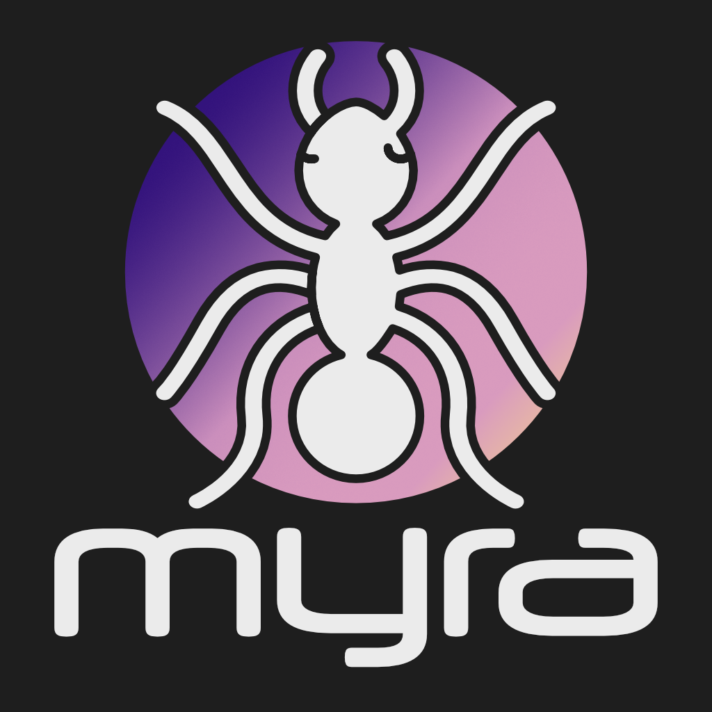

Ein Projekt im Rahmen des Studiengangs Angewandte Informatik (B. Sc.) an der FH Erfurt.  
Lizensierte Assets wurden aus dem Repository entfernt.  
Mitwirkende: Dario Daßler, Hendrick Lendeckel  

    
  

Die Plattform für immersive Bürger:innenbeteiligung und Stadtplanung.

# 🔎 Über Myra
Myra ist ein Prototyp für eine Bürger:innenbeteiligungs- und Stadtplanungsapp (AR).
Die App verfügt über drei Anwendungsszenarien: Showcase (VPS), Playground (Markerbased AR) und dem CreationSpace (VPS).
Im Showcase können User bereits eingereichte Entwürfe für eine verbesserte Stadt vor Ort, immersiv betrachten.
Der Playground stellt eine Möglichkeit zur kreativen Umgestaltung der markierten Orte. Assets können platziert, Straßen gezeichnet
und Simulationen gestartet werden. Der CreationSpace verbindet diese zwei Funktionalitäten und integriert einen Playground vor Ort.
